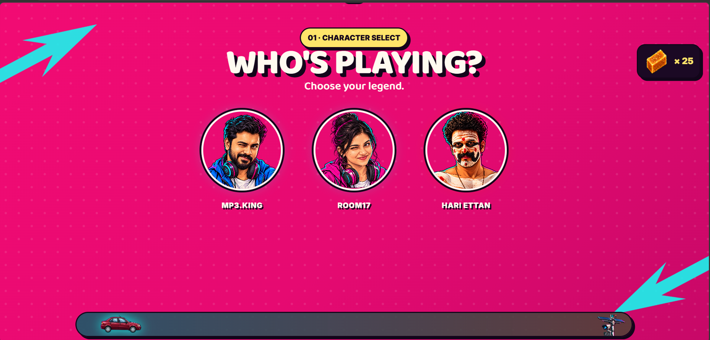
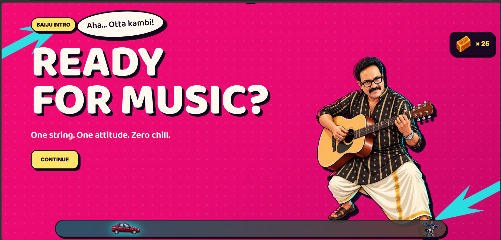

# Otta Kambi 🎸

## Basic Details
### Team Name: No Idea

### Team Members
- Team Lead: Geo George - Christ College of Engineering, Irinjalakuda
- Member 2: Freya Rose - Christ College of Engineering, Irinjalakuda

### Project Description
Otta Kambi is a chaotic one-string virtual guitar game where players can turn their PC keyboard into a guitar. Choose a character, play songs, experiment freely, collect Mysore Pak points, and survive the judgement of the characters along the way. 🎸

### The Problem (that doesn't exist)
Have you ever wanted to play a guitar without actually owning a guitar, knowing how to play one, or even knowing what you're doing?

We decided this was a serious problem that absolutely nobody asked us to solve.

### The Solution (that nobody asked for)
Introducing Otta Kambi — a browser-based one-string guitar experience where your keyboard becomes a guitar.

Just press A, S, D, F, G, H, J or K and make some music.

In Free Play mode, there are absolutely no rules. Press whatever you want, whenever you want. In Tutorial mode, however, you actually have to follow the notes and try not to disappoint Nadasha.

Complete a song, collect Mysore Pak, let the Ford Ikon drive across the screen, get photographed by an AI camera, and finally face Glixon for your score.

Because apparently, this was necessary.

## Technical Details
### Technologies/Components Used
For Software:
- JavaScript
- HTML
- CSS
- React
- Vite
- Web Audio API / HTML5 Audio
- LocalStorage
- Git
- GitHub
- VS Code
- Figma
- GitHub Copilot

For Hardware:
- No additional hardware required
- PC/Laptop
- Keyboard

### Implementation
For Software:

Otta Kambi is implemented as a React-based interactive web application.

The application begins with a character selection screen where the player can choose between MP3.King, Room17 and Hari Ettan.

MP3.King and Room17 lead into the main game while changing the visual theme to prioritize blue or pink respectively, while still retaining both colors.

Hari Ettan is a special character. Selecting him triggers a black and red warning screen with his dialogue:

> "I don't have time for this. Naale oru stage show ind."

After selecting a playable character, Baiju Chettan appears with an introduction before taking the player to the home page.

From the home page, the player can choose between Free Play and Tutorial/Song mode.

In Free Play, there are no rules. The player can press any supported keyboard key in any order and every key produces a corresponding guitar sound.

In Tutorial/Song mode, the player follows a predefined sequence of notes and must press the correct keyboard key at the correct time. Correct notes increase the score and Mysore Pak, while mistakes can eventually trigger Nadasha saying:

> "Don't produce too much okay!"

After completing a song, the player's score, accuracy, notes and Mysore Pak are calculated.

The Ford Ikon then travels from left to right near the bottom of the interface as a simple animation. It is not a progress bar and does not represent a percentage.

When the car reaches the AI camera, the camera flashes and the final score reveal begins.

Finally, Glixon appears with the final score reveal and background music, while the player receives their Mysore Pak reward.

